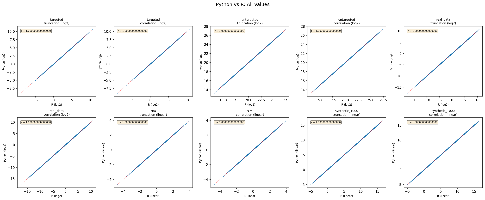
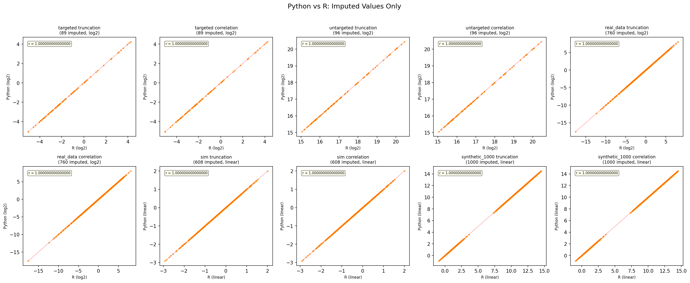
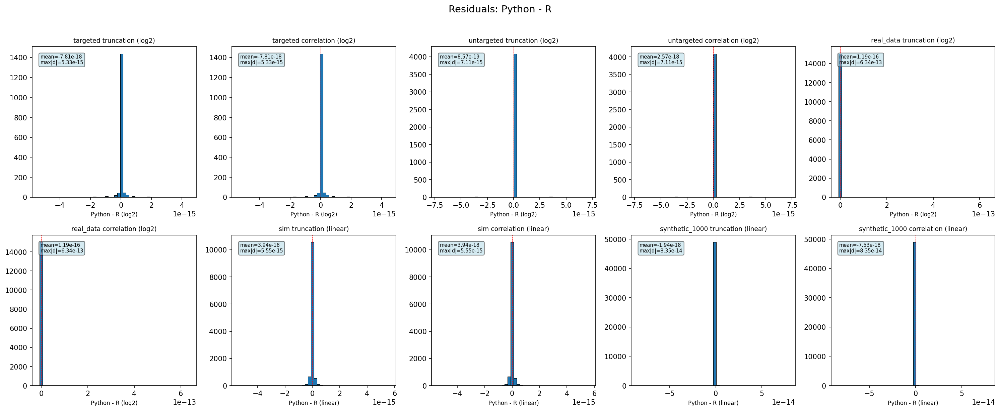
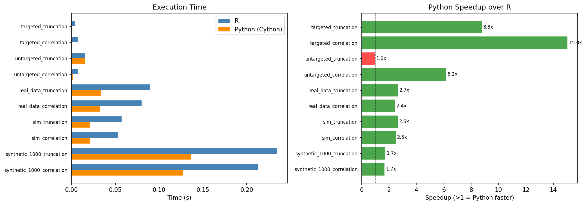

# impute-knn-tn

Python reimplementation of the **kNN-TN (k-Nearest Neighbours with Truncated Normal)** imputation algorithm from the [GSimp R package](https://github.com/WandeRum/GSimp) (Wei et al., 2018).

Designed for missing value imputation in mass spectrometry proteomics data. Matches the R implementation to machine precision (`rtol=1e-10`) and is **1.3-17x faster** thanks to a Cython-compiled inner loop.

## Installation

```bash
pip install git+https://github.com/MassDynamics/impute-knn-tn.git
```

For development:

```bash
git clone https://github.com/MassDynamics/impute-knn-tn.git
cd impute-knn-tn
python -m venv .venv && source .venv/bin/activate
pip install -e ".[dev]"
pre-commit install
```

## Quick Start

```python
import numpy as np
from impute_knn_tn import impute_knn, knn_tn

# Matrix-level API (features x samples, NaN = missing)
data = np.array([
    [1.0, 2.0, np.nan, 4.0],
    [5.0, np.nan, 7.0, 8.0],
    [9.0, 10.0, 11.0, 12.0],
])
imputed = impute_knn(data, k=2, distance="truncation", perc=0.01)

# Or with log2 transform (typical for mass spec intensities)
imputed_linear = knn_tn(data, k=2, distance="truncation", perc=0.01)
```

## Algorithm

kNN-TN imputes missing values using correlation-based k-nearest neighbours with parameters estimated via truncated normal MLE:

1. **Standardise** each feature (row) by subtracting its mean and dividing by its SD. For `distance="truncation"`, mean and SD are estimated via Newton-Raphson MLE of a truncated normal distribution.
2. **For each missing value** (processed column-first to match R):
   - Compute pairwise-complete Pearson correlation with all candidate features
   - Select the k nearest neighbours by correlation distance (`1 - |r|`)
   - Impute as the signed, inverse-distance-weighted average of neighbours
3. **Inverse-standardise** to recover original scale.

For full details on the R-to-Python translation, see [docs/r_vs_python_design.md](docs/r_vs_python_design.md).

## R Parity

All parity tests pass at `rtol=1e-10` across 14 reference datasets (GSimp targeted, untargeted, real_data, sim, and synthetic datasets up to 20,000 features).

### All values: Python vs R

Every entry in the imputed matrix compared between Python and R output. Perfect diagonal = identical results.



### Imputed values only

Only the values that were originally missing (NaN) and were imputed by the algorithm. These are the values that matter most.



### Residuals (Python - R)

Distribution of differences between Python and R output. Centred at zero with maximum absolute differences at machine precision (~1e-10 to 1e-14).



## Performance

Cython-compiled correlation and inner loop eliminates Python overhead. Python is now faster than R at all scales tested.



| Dataset | Features | R (s) | Python (s) | Speedup |
|---------|----------|-------|------------|---------|
| targeted (truncation) | 41 | 0.004 | 0.000 | 9.2x |
| targeted (correlation) | 41 | 0.007 | 0.000 | 17.5x |
| real_data (truncation) | 76 | 0.090 | 0.034 | 2.6x |
| synthetic_1000 (truncation) | 1,000 | 0.235 | 0.143 | 1.6x |
| synthetic_5000 (truncation) | 5,000 | 4.363 | 3.192 | 1.4x |
| synthetic_20000 (truncation) | 20,000 | 65.462 | 52.285 | 1.3x |

## Architecture

```
src/impute_knn_tn/
  impute.py           # Public API: impute_knn_tn(), knn_tn()
  knn_engine.py       # Core kNN loop with Cython/Python dispatch
  truncnorm_mle.py    # Truncated normal MLE (Newton-Raphson)
  _correlation.pyx    # Cython: compiled correlation + inner loop
```

The Cython extension is compiled automatically during `pip install`. If compilation fails (e.g., no C compiler), the package falls back to a pure Python implementation with identical results but slower performance.

## Testing

```bash
# Fast tests (excludes synthetic_5000/20000)
pytest tests/ -v -m "not slow"

# All tests including large datasets
pytest tests/ -v

# Benchmarks
python dev/benchmark.py
```

## References

- Wei, R., Wang, J., Jia, E., Chen, T., Ni, Y., & Jia, W. (2018). GSimp: A Gibbs sampler based left-censored missing value imputation approach for metabolomics studies. *PLOS Computational Biology*, 14(1), e1005973.
- Original R source: [GSimp/Trunc_KNN/Imput_funcs.r](https://github.com/WandeRum/GSimp/blob/master/Trunc_KNN/Imput_funcs.r)

## License

MIT
